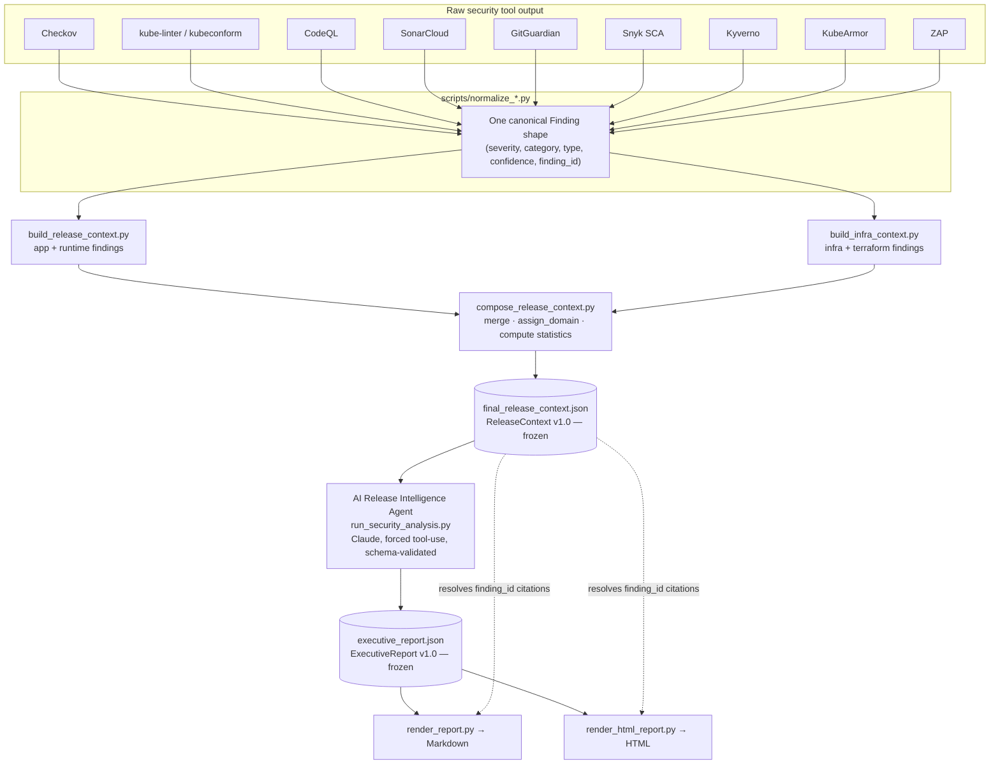
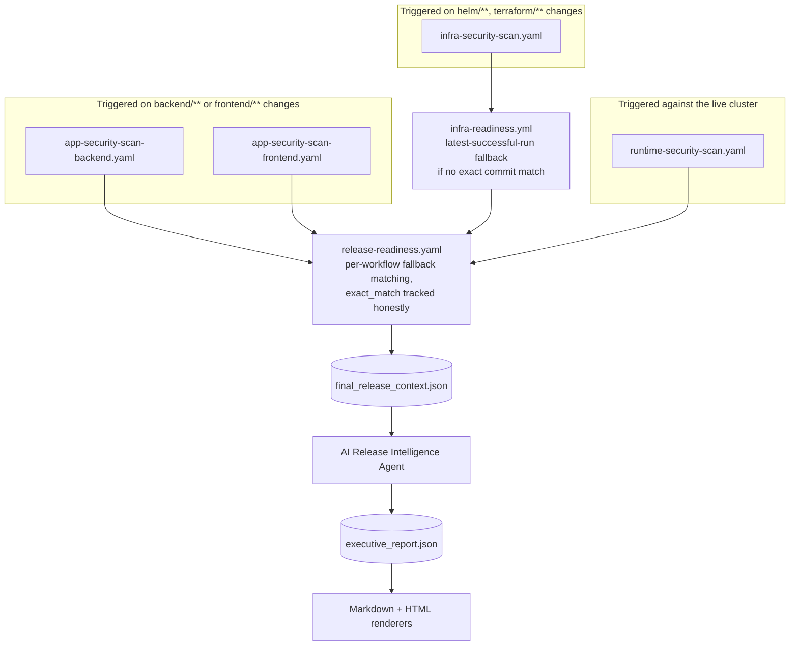
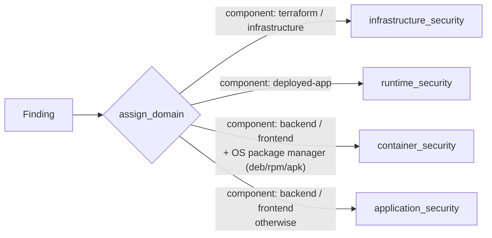

# Architecture — AI Release Intelligence Platform

This document is the deeper technical reference for the platform summarized in the [README](README.md#ai-release-intelligence-platform). If you just want the overview, start there. This is for understanding exactly how a finding gets from a scanner's raw output to a cited line in a release readiness recommendation.

## Design principles (frozen)

- **Security tools own facts.** A `Finding`'s severity, category, and existence come from a real scanner — never invented or inferred by the AI layer.
- **Python owns deterministic computation.** Domain assignment, occurrence counting, statistics — anything that has one correct answer given the input is computed in Python, not asked of a model.
- **AI owns reasoning only.** Cross-domain correlation, prioritization, the release readiness recommendation — judgment calls, not facts. The AI never invents a finding, never changes a severity, and cites every claim back to a real `finding_id`.
- **Humans own the deployment decision.** The AI's output is a recommendation with evidence, not an automated gate.
- **One canonical `Finding` model, one flat findings collection, one `ReleaseContext`, one AI agent.** Any new scanner integrates by producing canonical findings — it does not require a schema redesign.

These held through this project's full build-out, including a recent attempt to add a second LLM provider as a fallback — which was deliberately built, fully tested, then **not adopted**, on the reasoning that an unvalidated second reasoning path is a worse risk than the rare outage it would guard against. The provider abstraction pattern is documented here for that reason: if you ever do revisit it, the design work and the reason it wasn't used are both worth knowing.

## The pipeline



## Workflow orchestration

The pipeline above runs across several independently-triggered GitHub Actions workflows, not one linear job. `release-readiness.yaml` pulls them together at the end:



**Why "fallback matching" instead of an exact commit requirement**: `app-security-scan-backend.yaml` only triggers on `backend/**` changes. A release that only touched `helm/**` or `scripts/` would have *no* run of that workflow at its exact commit — requiring an exact match would mean every such release silently has zero application-security data. Instead, `release-readiness.yaml` finds each workflow's latest *successful* run regardless of commit, and records honestly whether that was an exact match:

```json
"provenance": {
  "application_security": {
    "per_workflow": {
      "app-security-scan-backend.yaml": {"source_version": "231b0c9...", "exact_match": true},
      "backend-ci.yaml": {"source_version": "921c68c...", "exact_match": false}
    },
    "any_used_fallback_commit": true
  }
}
```

This is surfaced as real provenance data, not silently assumed — confirmed correct against a real run where `app-security-scan-backend.yaml` had genuinely run at the exact target commit (`exact_match: true`) while `backend-ci.yaml`'s latest success was from an older, different one (`exact_match: false`, correctly flagged).

## Domain model

Every finding lands in exactly one of four domains, assigned deterministically in `assign_domain()` — never inferred by the AI:



| Domain | Real-data status |
|---|---|
| `infrastructure_security` | Validated across many real CI runs (Checkov, kube-linter, kubeconform) |
| `runtime_security` | Validated across many real CI runs (Kyverno, KubeArmor, ZAP against the live cluster) |
| `application_security` | Validated with real data: 119 real findings (CodeQL, SonarCloud, GitGuardian, Snyk SCA) in one real run, zero invalid citations, cross-domain correlation integrity confirmed correct |
| `container_security` | Real findings confirmed flowing through (8 real CVEs from real Snyk container scans — `expat`, `gnutls28`, `krb5` — in one real run). Note this is a narrower claim than `application_security`'s: it confirms the deterministic data path works, not that the AI's reasoning over this domain specifically, or citation/rendering correctness for it, has been separately verified yet. |

## Schema reference

Both schemas are **frozen** — no field additions or type changes without a deliberate decision to unfreeze, not an incidental one. Defined as importable Python modules (`scripts/release_context_schema.py`, `scripts/executive_report_schema.py`), not separately-committed `.schema.json` files, so there's one source of truth producers and consumers both import.

### `ReleaseContext` v1.0 (`final_release_context.json`)

Key top-level fields: `release`, `provenance`, `findings[]`, `remediation_guide`, `scan_status`, `release_statistics`, `signal_availability`, `sbom_summary`, `dependency_summary`, `supply_chain`, `schema_validation`, `terraform_validation`.

Each `Finding`: `finding_id` (12-char hex, hash of `component|tool|rule_id|category`), `component`, `tool`, `rule_id`, `severity`, `category`, `type`, `confidence`, `domain`, `occurrence_count`, `sample_message`, plus tool-specific optional fields (`package_name`/`package_version`/`package_manager` for Snyk).

### `ExecutiveReport` v1.0 (`executive_report.json`)

AI-authored fields: `executive_summary`, `cross_domain_correlations[]`, `top_risks[]`, `priority_actions[]`, `release_readiness`, `assumptions_and_unknowns[]`. Every evidence array (`supporting_evidence`, `blocking_evidence`) contains `finding_id` references *only* — the model never restates a finding's content, only cites it. Python-owned fields (`report_id`, `generated_at`, `release_context_ref`) are added after the model responds and are never part of what the model is asked to produce.

`release_readiness.recommendation` is one of `APPROVE`, `APPROVE_WITH_CONDITIONS`, `MANUAL_REVIEW_REQUIRED`, `DO_NOT_APPROVE` — all four verified rendering correctly in both HTML and Markdown.

## Test suite

507 automated tests in `tests/`:

- Schema validation for both contracts, against golden fixtures and real frozen CI artifacts.
- Evidence-citation integrity — every cited `finding_id` must exist in real findings. This is the single highest-value check: it's the exact test that would have caught a real citation bug from an early run (a transposed character in a `finding_id`, cited twice with two slightly different values).
- Cross-domain correlation integrity — a correlation's claimed `affected_domains` must be backed by the actual domain of its cited evidence (with `supply_chain` as the one deliberate exception — a real cross-cutting concern with no finding-level domain of its own).
- HTML/Markdown renderer correctness across all 4 recommendation values, XSS-escaping safety, accessibility (keyboard focus, mobile layout).
- A golden regression dataset (`tests/fixtures/golden/`) covering 8 representative scenarios: clean, moderate-risk, critical, infrastructure-heavy, runtime-heavy, application-heavy, container-heavy, mixed-domain — generated *through* the real pipeline functions, not hand-typed, so they can't silently drift from what production actually does.

```bash
pip install -r tests/requirements.txt
python3 -m pytest
```