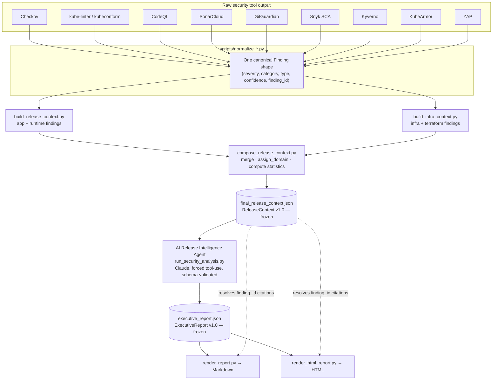
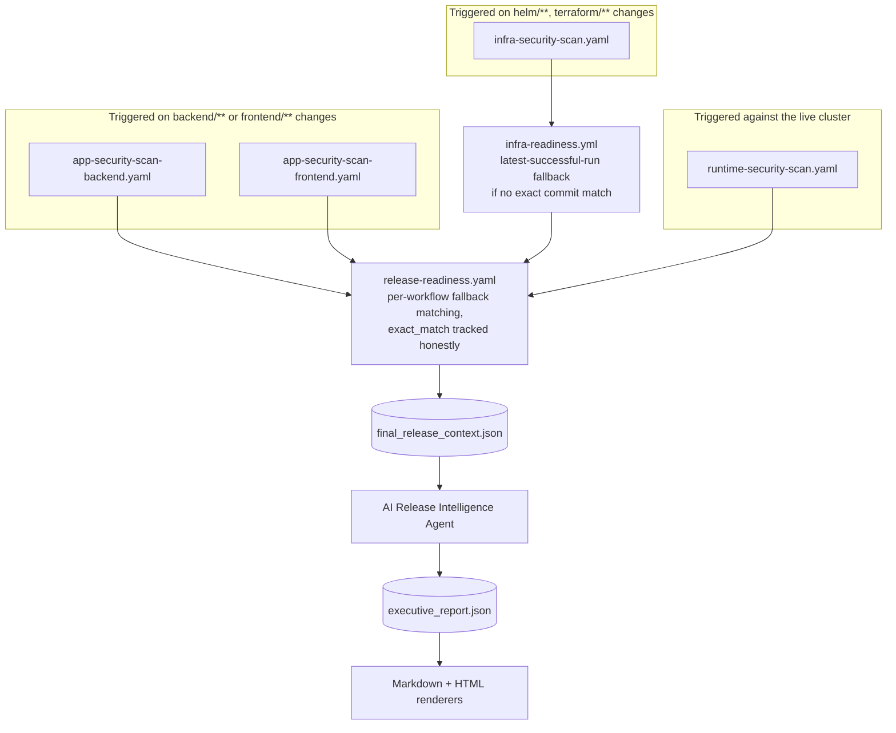
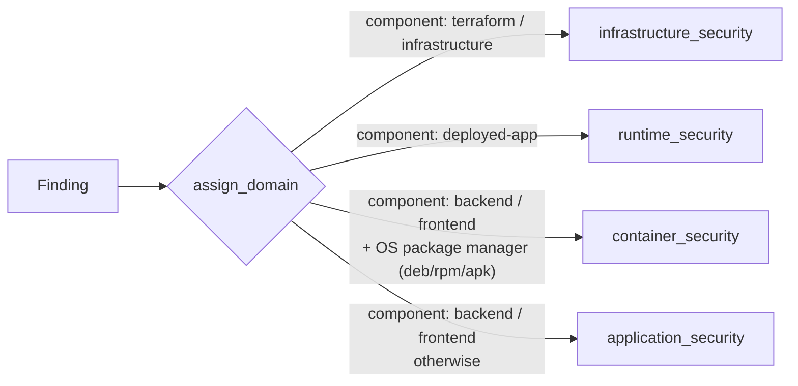

# Architecture — AI Release Intelligence Platform

This document is the deeper technical reference for the platform summarized in the [README](README.md#ai-release-intelligence-platform). If you just want the overview, start there. This is for understanding exactly how a finding gets from a scanner's raw output to a cited line in a release readiness recommendation.

## Design principles (frozen)

- **Security tools own facts.** A `Finding`'s severity, category, and existence come from a real scanner — never invented or inferred by the AI layer.
- **Python owns deterministic computation.** Domain assignment, occurrence counting, statistics — anything that has one correct answer given the input is computed in Python, not asked of a model.
- **AI owns reasoning only.** Cross-domain correlation, prioritization, the release readiness recommendation — judgment calls, not facts. The AI never invents a finding, never changes a severity, and cites every claim back to a real `finding_id`.
- **Humans own the deployment decision.** The AI's output is a recommendation with evidence, not an automated gate.
- **One canonical `Finding` model, one flat findings collection, one `ReleaseContext`, one AI agent.** Any new scanner integrates by producing canonical findings — it does not require a schema redesign.

These held through this project's full build-out, including a recent attempt to add a second LLM provider as a fallback — which was deliberately built, fully tested, then **not adopted**, on the reasoning that an unvalidated second reasoning path is a worse risk than the rare outage it would guard against. The provider abstraction pattern is documented here for that reason: if you ever do revisit it, the design work and the reason it wasn't used are both worth knowing.

## The pipeline


```mermaid
flowchart TD
    subgraph Tools["Raw security tool output"]
        T1[Checkov]
        T2["kube-linter / kubeconform"]
        T3[CodeQL]
        T4[SonarCloud]
        T5[GitGuardian]
        T6[Snyk SCA]
        T7[Kyverno]
        T8[KubeArmor]
        T9[ZAP]
    end

    subgraph Normalize["scripts/normalize_*.py"]
        N["One canonical Finding shape<br/>(severity, category, type, confidence, finding_id)"]
    end
    T1 --> N
    T2 --> N
    T3 --> N
    T4 --> N
    T5 --> N
    T6 --> N
    T7 --> N
    T8 --> N
    T9 --> N

    N --> B1["build_release_context.py<br/>app + runtime findings"]
    N --> B2["build_infra_context.py<br/>infra + terraform findings"]

    B1 --> C["compose_release_context.py<br/>merge · assign_domain · compute statistics"]
    B2 --> C

    C --> RC[("final_release_context.json<br/>ReleaseContext v1.0 — frozen")]

    RC --> AI["AI Release Intelligence Agent<br/>run_security_analysis.py<br/>Claude, forced tool-use, schema-validated"]
    AI --> ER[("executive_report.json<br/>ExecutiveReport v1.0 — frozen")]

    ER --> R1["render_report.py → Markdown"]
    ER --> R2["render_html_report.py → HTML"]
    RC -. resolves finding_id citations .-> R1
    RC -. resolves finding_id citations .-> R2
```

## Workflow orchestration

The pipeline above runs across several independently-triggered GitHub Actions workflows, not one linear job. `release-readiness.yaml` pulls them together at the end:


```mermaid
flowchart TD
    subgraph AppTriggers["Triggered on backend/** or frontend/** changes"]
        ASB[app-security-scan-backend.yaml]
        ASF[app-security-scan-frontend.yaml]
    end
    subgraph InfraTriggers["Triggered on helm/**, terraform/** changes"]
        ISS[infra-security-scan.yaml]
    end
    subgraph RuntimeTriggers["Triggered against the live cluster"]
        RSS[runtime-security-scan.yaml]
    end

    ISS --> IR["infra-readiness.yml<br/>latest-successful-run fallback<br/>if no exact commit match"]

    ASB --> RR["release-readiness.yaml<br/>per-workflow fallback matching,<br/>exact_match tracked honestly"]
    ASF --> RR
    IR --> RR
    RSS --> RR

    RR --> RC[("final_release_context.json")]
    RC --> AI[AI Release Intelligence Agent]
    AI --> ER[("executive_report.json")]
    ER --> REND[Markdown + HTML renderers]
```

**Why "fallback matching" instead of an exact commit requirement**: `app-security-scan-backend.yaml` only triggers on `backend/**` changes. A release that only touched `helm/**` or `scripts/` would have *no* run of that workflow at its exact commit — requiring an exact match would mean every such release silently has zero application-security data. Instead, `release-readiness.yaml` finds each workflow's latest *successful* run regardless of commit, and records honestly whether that was an exact match:

```json
"provenance": {
  "application_security": {
    "per_workflow": {
      "app-security-scan-backend.yaml": {"source_version": "231b0c9...", "exact_match": true},
      "backend-ci.yaml": {"source_version": "921c68c...", "exact_match": false}
    },
    "any_used_fallback_commit": true
  }
}
```

This is surfaced as real provenance data, not silently assumed — confirmed correct against a real run where `app-security-scan-backend.yaml` had genuinely run at the exact target commit (`exact_match: true`) while `backend-ci.yaml`'s latest success was from an older, different one (`exact_match: false`, correctly flagged).

## Domain model

Every finding lands in exactly one of four domains, assigned deterministically in `assign_domain()` — never inferred by the AI:


```mermaid
flowchart LR
    F[Finding] --> D{assign_domain}
    D -->|"component: terraform / infrastructure"| INF[infrastructure_security]
    D -->|"component: deployed-app"| RUN[runtime_security]
    D -->|"component: backend / frontend<br/>+ OS package manager (deb/rpm/apk)"| CON[container_security]
    D -->|"component: backend / frontend<br/>otherwise"| APP[application_security]
```

| Domain | Real-data status |
|---|---|
| `infrastructure_security` | Validated across many real CI runs (Checkov, kube-linter, kubeconform) |
| `runtime_security` | Validated across many real CI runs (Kyverno, KubeArmor, ZAP against the live cluster) |
| `application_security` | Validated with real data: 119 real findings (CodeQL, SonarCloud, GitGuardian, Snyk SCA) in one real run, zero invalid citations, cross-domain correlation integrity confirmed correct |
| `container_security` | Real findings confirmed flowing through (8 real CVEs from real Snyk container scans — `expat`, `gnutls28`, `krb5` — in one real run). Note this is a narrower claim than `application_security`'s: it confirms the deterministic data path works, not that the AI's reasoning over this domain specifically, or citation/rendering correctness for it, has been separately verified yet. |

## Schema reference

Both schemas are **frozen** — no field additions or type changes without a deliberate decision to unfreeze, not an incidental one. Defined as importable Python modules (`scripts/release_context_schema.py`, `scripts/executive_report_schema.py`), not separately-committed `.schema.json` files, so there's one source of truth producers and consumers both import.

### `ReleaseContext` v1.0 (`final_release_context.json`)

Key top-level fields: `release`, `provenance`, `findings[]`, `remediation_guide`, `scan_status`, `release_statistics`, `signal_availability`, `sbom_summary`, `dependency_summary`, `supply_chain`, `schema_validation`, `terraform_validation`.

Each `Finding`: `finding_id` (12-char hex, hash of `component|tool|rule_id|category`), `component`, `tool`, `rule_id`, `severity`, `category`, `type`, `confidence`, `domain`, `occurrence_count`, `sample_message`, plus tool-specific optional fields (`package_name`/`package_version`/`package_manager` for Snyk).

### `ExecutiveReport` v1.0 (`executive_report.json`)

AI-authored fields: `executive_summary`, `cross_domain_correlations[]`, `top_risks[]`, `priority_actions[]`, `release_readiness`, `assumptions_and_unknowns[]`. Every evidence array (`supporting_evidence`, `blocking_evidence`) contains `finding_id` references *only* — the model never restates a finding's content, only cites it. Python-owned fields (`report_id`, `generated_at`, `release_context_ref`) are added after the model responds and are never part of what the model is asked to produce.

`release_readiness.recommendation` is one of `APPROVE`, `APPROVE_WITH_CONDITIONS`, `MANUAL_REVIEW_REQUIRED`, `DO_NOT_APPROVE` — all four verified rendering correctly in both HTML and Markdown.

## Test suite

558 automated tests in `tests/`:

- Schema validation for both contracts, against golden fixtures and real frozen CI artifacts.
- Evidence-citation integrity — every cited `finding_id` must exist in real findings. This is the single highest-value check: it's the exact test that would have caught a real citation bug from an early run (a transposed character in a `finding_id`, cited twice with two slightly different values).
- Cross-domain correlation integrity — a correlation's claimed `affected_domains` must be backed by the actual domain of its cited evidence (with `supply_chain` as the one deliberate exception — a real cross-cutting concern with no finding-level domain of its own).
- HTML/Markdown renderer correctness across all 4 recommendation values, XSS-escaping safety, accessibility (keyboard focus, mobile layout).
- A golden regression dataset (`tests/fixtures/golden/`) covering 8 representative scenarios: clean, moderate-risk, critical, infrastructure-heavy, runtime-heavy, application-heavy, container-heavy, mixed-domain — generated *through* the real pipeline functions, not hand-typed, so they can't silently drift from what production actually does.

```bash
pip install -r tests/requirements.txt
python3 -m pytest
```
- Workflow structural invariants (`tests/test_workflow_invariants.py`) — 24 guards over the security workflows themselves: a scan status must derive from a step's own exit code rather than `needs.<job>.result` (which `continue-on-error` masks), no scanner-side severity filtering, actions pinned to commit SHAs, deploy gated on push-from-`main`, and the KubeArmor capture window must be actively exercised while its stream is open (ordering, settle time and window length are each asserted, because a mis-ordered exercise produces an empty capture with no error). Every one of these encodes a defect that shipped green over incomplete data.
- API request shape (`tests/test_api_request_shape.py`) — `temperature` pinned, `tool_choice` forced, API key in the header not the body. `urlopen` is stubbed, so no network call and no key.
- Offline demo integrity (`tests/test_demo_report.py`) — the nine fixture pairs `scripts/demo_report.py` renders are referenced by filename and read by nothing else in the suite, so a renamed fixture would break the one entry point a stranger actually runs while every other test stayed green. The end-to-end case strips `ANTHROPIC_API_KEY` from the child environment, making "needs no API key" a checked claim.
- Documentation accuracy (`tests/test_docs_accuracy.py`) — the test count, Kyverno/KubeArmor policy counts and workflow count claimed in `README.md` and `ARCHITECTURE.md` are compared against reality, and no committed report may contain a live host address. A number a reader can check and find wrong discredits the numbers they cannot check.

### Run stability

`reports/run_ledger.jsonl` records one row per real AI run — verdict, confidence, counts, and the coarse themes of its correlations. `scripts/run_ledger.py summary` reports how often each theme recurs.

This is deliberately the cheap tenth of an evaluation harness. The expensive nine tenths — hand-authored expected correlations per fixture, a scoring function, and runs commissioned purely to measure — were considered and rejected: labelling ground truth for nine fixtures is days of judgement work needing maintenance whenever a fixture changes, to grade a system whose verdict turns out to be the stable part. Recording runs you are already paying for costs nothing and answers the question people actually ask.

Variance is only meaningful over identical evidence, so `summary` groups by release version and separates within-group stability from cross-commit spread. Reading a cross-commit difference as model noise would be the same class of overstatement this pipeline exists to prevent.

Across the first four recorded runs (all `claude-sonnet-4-6`, different commits): the verdict was `DO_NOT_APPROVE` in every one, `top_risks` was 8 in every one, correlations ranged 5–7, and 4 of 8 correlation themes appeared in all four. The decision is stable; the reasoning around it is roughly half stable. Those runs did not share evidence, so that figure is an upper bound on model variance, not a measurement of it.

## Known gaps

Stated plainly, because a security tool that overstates its own coverage is
the exact failure it exists to catch.

### Unmeasured

- **Reasoning quality.** Citations are checked for existence, and correlations for structural consistency with their evidence. Whether an insight is a *good* one is a human judgement. Nothing here measures it, and `tests/test_cross_domain_integrity.py` says so in its own docstring.
- **Run-to-run stability.** `temperature` is pinned to 0 to reduce variance, but inference is not bit-deterministic even at 0, and nobody has quantified what remains. Doing so means N runs over one context — real API spend, deliberately not incurred.
- **`container_security` reasoning.** Real findings are confirmed flowing through the data path (8 CVEs in a real run). That is narrower than `application_security`, where AI reasoning and citation correctness were verified against 119 real findings.

### Not implemented

The pipeline's design describes stages that do not exist yet: **ArgoCD / GitOps** (deploys run `helm upgrade` directly from `deploy-backend.yaml` / `deploy-frontend.yaml` — no workflow references ArgoCD), **Jira ticketing**, **Slack notifications**, the **AI Remediation Agent** (no auto-created fix PRs), and **Falco**.

### Corrected — KubeArmor was not broken

For most of this project's life `scan_status.deployed-app.kubearmor` reported `NO_SIGNAL`, and two investigations concluded it was an upstream containerd 2.x defect. **That was wrong.** KubeArmor produces the expected alerts — verified end to end on the live cluster, through daemonset → relay → `karmor` → normalizer, with correct policy name, severity and MITRE tag.

The real cause was an **idle capture window**. KubeArmor records what happens while its window is open; every policy matches operator-style behaviour (shell execution, sensitive file reads, payload tools) and a steady-state web app does none of it. The window opened, nothing happened, it closed empty. `NO_SIGNAL` was the correct report of a correct-but-empty capture — the mechanism working exactly as designed, on an input that carried no information.

`.github/scripts/exercise-kubearmor-policies.sh` now generates that behaviour during the window, the same active-probing model ZAP uses for DAST. Full correction, including what the earlier investigation probably hit and two caveats that remain open (file-path policies, alert throttling), in [`helm/bootstrap/README.md`](helm/bootstrap/README.md).

`NO_SIGNAL` itself stays. It remains the honest answer whenever a bounded capture is genuinely quiet, and it is still the reason this was visible at all rather than being reported as a clean runtime domain.

### Deliberate, not defects

- **CloudCart's vulnerabilities are planted** and asserted as still-present by the test suites. See [`SECURITY.md`](SECURITY.md).
- **The IDOR is intentional.** `backend/routes/identity.py` unifies where caller identity is read from and stops malformed input returning HTTP 500; it deliberately does not add authentication.
- **No type hints anywhere** (0/114 in `scripts/`, 0/53 in `backend/`). A half-annotated tree implies a guarantee that only sometimes holds, so adopting them is a deliberate, all-at-once decision rather than something to slip into an unrelated change. The convention that does apply: every module carries a docstring explaining why it exists and what failure it prevents.
- **An unresolvable `finding_id` warns rather than fails.** Malformed ids fail schema validation and the renderer refuses to write the file; a well-formed id matching no finding renders and emits a `::warning::`, treated as a data-quality signal rather than grounds to discard an otherwise-valid report.
